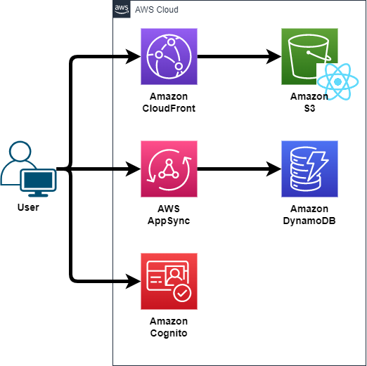

# AppSyncを使用したリアルタイムチャットアプリサンプル

- npmインストールコマンド
```
npm i
または
npm i @aws-cdk/core @aws-cdk/aws-appsync @aws-cdk/aws-dynamodb @aws-cdk/aws-cognito @aws-cdk/aws-s3 @aws-cdk/aws-cloudfront @aws-cdk/aws-cloudfront-origins @aws-cdk/aws-s3-deployment
```

- cdk デプロイコマンド
```
cdk deploy
```

- cdk 環境削除コマンド
```
cdk destroy
```

- AppSyncリソース作成コマンド
```
amplify codegen
```

## 環境

| Partition Key | バージョン |
| ------------- | ---------- |
| Node.js       | v18.12.1   |
| npm           | 9.2.0      |
| CDK           | 2.53.0     |

## インフラ構成図



## データ設計

**テーブル名：ChatTable**

| Partition Key | Data          | Data          | Data        |
| ------------- | ------------- | ------------- | ----------- |
| ChatID (S)    | UserID (S)    | Timestamp (S) | Message (S) |

- **ChatID** (S): メッセージを送信時に発行したチャットID。メッセージはチャットIDによってパーティション化されます。
- **UserID** (S): メッセージを送信したユーザーのCognito User PoolにおけるユーザーID。
- **Timestamp** (S): メッセージが送信されたタイムスタンプ。これによりメッセージはユーザーごとに時間順にソートされます。
- **Message** (S): ユーザーが送信したメッセージのテキスト。

